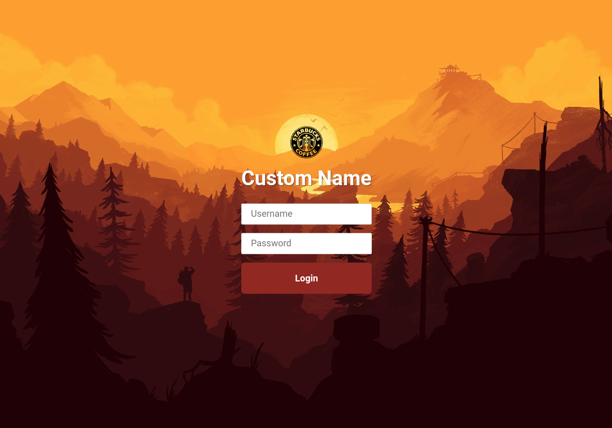

# filebrowser-branding-ssl-autoupdate-loginratelimiter



# filebrowser.org
https://github.com/filebrowser/filebrowse
 - Custom Branding
 - Nginx Self Signed SSL Certificate
 - Watchtower Auto Updating
 - Login Rate Limiter

# Notes
 - Access GUI on SSL/TLS port `8082`, feel free to change back to `443` in the `docker-compose.yml` (nginx part)

# Setup Guide
 - Step 1-8 are mostly copy and paste scripted
 - Step 9-12 configure GUI for custom branding
 - Step 12-16 upload media branding files


## Script Part

**1. Go to where you want container stored**
```
cd /opt
```


**2. Create Directory Stucture**
```
mkdir -p ./filebrowser/app/filebrowser/filesystem
mkdir -p ./filebrowser/app/filebrowser/branding/img/icons
mkdir -p ./filebrowser/app/nginx
```


**3. Filebrower - Database**
```
touch ./filebrowser/app/filebrowser/database.db
```


**4. Filebrower - Custom CSS Branding**
```
cat <<'EOT' >> ./filebrowser/app/filebrowser/branding/custom.css
#login {
  background: #200003;
  /* background-image: url("./img/background.jpg"); */   /* /filebrowser/app/filebrowser/branding/img/background.jpg */
  background-image: url("https://wallpaperaccess.com/full/2279196.jpg");
  background-size: cover;
  background-position: center;
  background-repeat: no-repeat;
}

#login > form > h1 {
  color: #FFF;
  text-shadow: rgba(255, 255, 255, 0.1) -1px -1px 1px, rgba(0, 0, 0, 0.5) 1px 1px 1px;
}

#login > form > input {
  margin: 16px 0;
  -webkit-border-radius: 3px;
  -moz-border-radius: 3px;
  border-radius: 3px;
  padding-bottom: 10px;
  font-size: 18px;
  color: rgba(0,0,0,0.8);
}

#login > form > .button {
  background-color: #93281e;
  padding: 20px;
  -webkit-border-radius: 7px;
  -moz-border-radius: 7px;
  border-radius: 7px;
  color: rgba(255,255,255,1);
  font-weight: bold;
  cursor: pointer;
  transition: all 600ms ease-in-out;
}

#login > form > .button:hover {
  background: #bb2819!important;
}
EOT
```

**5. Nginx - Site Config**
```
cat <<'EOT' >> ./filebrowser/app/nginx/default.conf

# Security - Bruteforce Protection
limit_req_zone $binary_remote_addr zone=login:10m rate=1r/m;		# (10 MB Shared Memory Zone, 1 requests per minute.... actually 15 requests per min see 'burst=14' at bottom)

server {

  # Hostname
  server_name					127.0.0.1;

  # Port/SSL
  listen					443 ssl;

  # SSL/Certs
  ssl_certificate				/etc/ssl/web.crt;
  ssl_certificate_key				/etc/ssl/web.key;

  # Nginx Version Exposure
  server_tokens					off;

  location / {

    # Proxy to Docker Container
    proxy_pass					http://fb_filebrowser:80/;

    # Proxy SSL
    proxy_ssl_server_name			on;

    # WS Support
    proxy_http_version				1.1;
    proxy_set_header Upgrade			$http_upgrade;

    # Proxy Cache
    proxy_cache_bypass				$http_upgrade;

    # Proxy Timeouts
    proxy_connect_timeout			999999999;
    proxy_send_timeout				999999999;
    proxy_read_timeout				999999999;

    # Proxy Buffers
    proxy_buffers				8 32k;
    proxy_buffer_size				64k;

    # Prevent 502 Bad Gateway Errors
    client_max_body_size			1024M;

    # Pass Original IP
    proxy_set_header Host			$host;
    proxy_set_header X-Real-IP			$remote_addr;
    proxy_set_header X-Forwarded-For		$proxy_add_x_forwarded_for;
    proxy_set_header X-Forwarded-Proto		$scheme;
    proxy_set_header X-Forwarded-Host		$host;
    proxy_set_header X-Forwarded-Port		$server_port;

    # Security Headers
    add_header X-XSS-Protection			"1; mode=block" always;
    add_header X-Content-Type-Options		"nosniff" always;
    add_header Referrer-Policy			"no-referrer-when-downgrade" always;
    add_header Permissions-Policy		"interest-cohort=()" always;

    # Enable With Caution
    #add_header Content-Security-Policy		"default-src 'self' http: https: ws: wss: data: blob: 'unsafe-inline'; frame-ancestors 'self';" always;
    #add_header Strict-Transport-Security	"max-age=31536000; includeSubDomains" always;
  }

  location /api/login {
    # Proxy to Docker Container
    proxy_pass					http://fb_filebrowser:80/api/login;

    # Auth Bruteforce Login Limiter
    limit_req zone=login burst=14 nodelay;	# For zone login as specfified at top
  }

}
EOT
```


**6. Nginx - Self Signed Certificate**
```
openssl req -x509 -nodes -days 99999 -newkey rsa:4096 -keyout ./filebrowser/app/nginx/web.key -out ./filebrowser/app/nginx/web.crt
```


**7. General - Start/Stop Scripts**
```
cat <<'EOT' >> ./filebrowser/start.sh
cd /opt/filebrowser
docker compose up -d
EOT

cat <<'EOT' >> ./filebrowser/stop.sh
cd /opt/filebrowser
docker compose down
EOT

chmod +x ./filebrowser/*.sh
```

**8. General - Docker Compose**
```
cat <<'EOT' >> ./filebrowser/compose.yml
version: "3.7"
services:

  filebrowser:
    image: filebrowser/filebrowser:latest
    container_name: fb_filebrowser
    environment:
      - PUID=1000
      - PGID=1000
      - TZ=Europe/London
    ports:
      - "80/tcp"
    volumes:
      - ./app/filebrowser/filesystem:/srv
      - ./app/filebrowser/branding:/branding
      - ./app/filebrowser/database.db:/database.db
    restart: unless-stopped
    deploy:
      resources:
        limits:
          memory: 1024M
    labels:
      - com.centurylinklabs.watchtower.enable=true

  nginx:
    image: nginx:latest
    container_name: fb_nginx
    hostname: 127.0.0.1
    ports:
      - "8082:443/tcp"
    volumes:
      - ./app/nginx/default.conf:/etc/nginx/conf.d/default.conf
      - ./app/nginx/web.crt:/etc/ssl/web.crt
      - ./app/nginx/web.key:/etc/ssl/web.key
    restart: unless-stopped
    deploy:
      resources:
        limits:
          memory: 256M

  watchtower:
    image: containrrr/watchtower
    container_name: fb_watchtower
    environment:
      - WATCHTOWER_SCHEDULE=0 0 4 * * *
      - TZ=Europe/London
      - WATCHTOWER_INCLUDE_RESTARTING=true
      - WATCHTOWER_CLEANUP=true
      - WATCHTOWER_DEBUG=false
    volumes:
      - /var/run/docker.sock:/var/run/docker.sock
    command: fb_filebrowser fb_nginx
    restart: unless-stopped
    deploy:
      resources:
        limits:
          memory: 256M
EOT
```

**9. General - Start the Stack**
```
/opt/filebrowser/start.sh
```

## GUI Part
**10. Login to the GUI _(admin:admin)_ and change the default password immediately**
 - `https://<IP>:8082`

**11. Click Settings > Profile Settings**
 - Change your password from admin/admin

**12. Click Settings > Global Settings**
 - Instance Name = Custom Name
 - Branding directory path = /branding

**13. Logout and reload login screen (CTRL + F5)**


## Media Part
**14. Background Location + Configure CSS `#login` with `background-image: url("./img/background.jpg");`**

`./filebrowser/app/filebrowser/branding/img/background.jpg`

**15. Logo Location ([SVG Format](https://www.google.com/search?q=png+to+svg))**

`./filebrowser/app/filebrowser/branding/img/logo.svg`

**16. Favicons Location ([Generation](https://realfavicongenerator.net/))**

`./filebrowser/app/filebrowser/branding/img/icons/`

**17. Logout and reload login screen (CTRL + F5)**

Done :)
